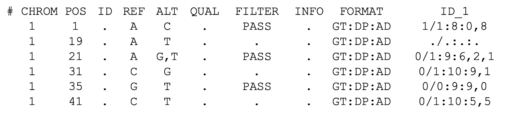

## Genomic sequencing and representing genetic variation as a Variant Call Format file

Watch our class: 

**Spanish**

**English**

**Recommended Readings:**

- The Variant Call Format (VCF) Version 4.2 Specification.  Danecek, P., Auton, A., Abecasis, G., Albers, C. A., Banks, E., 
DePristo, M. A., ... & 1000 Genomes Project Analysis Group. (2011). 
- The variant call format and VCFtools. Bioinformatics, 27(15), 2156-2158.  Chaitankar, Vijender, et al. "Next generation sequencing technology and 
genomewide data analysis: Perspectives for retinal research." Progress in retinal and eye research 55 (2016): 1-31 

**Homework:**

1. Which of the following calls can be considered "good quality"

2. Explore the most common files used in genetic data. The [samtools repository](https://github.com/samtools/hts-specs) details the specific features of each file type. I have also added some examples of the [fasta/fastq files](fasta-fastq.md)

3. Here we have uploaded a [vcf](/Module_1_Introduction/Week_2/chr22.vcf) of  chromosome 22 for you tu explore.

Review the homework here: 

**Spanish** 

**English**

